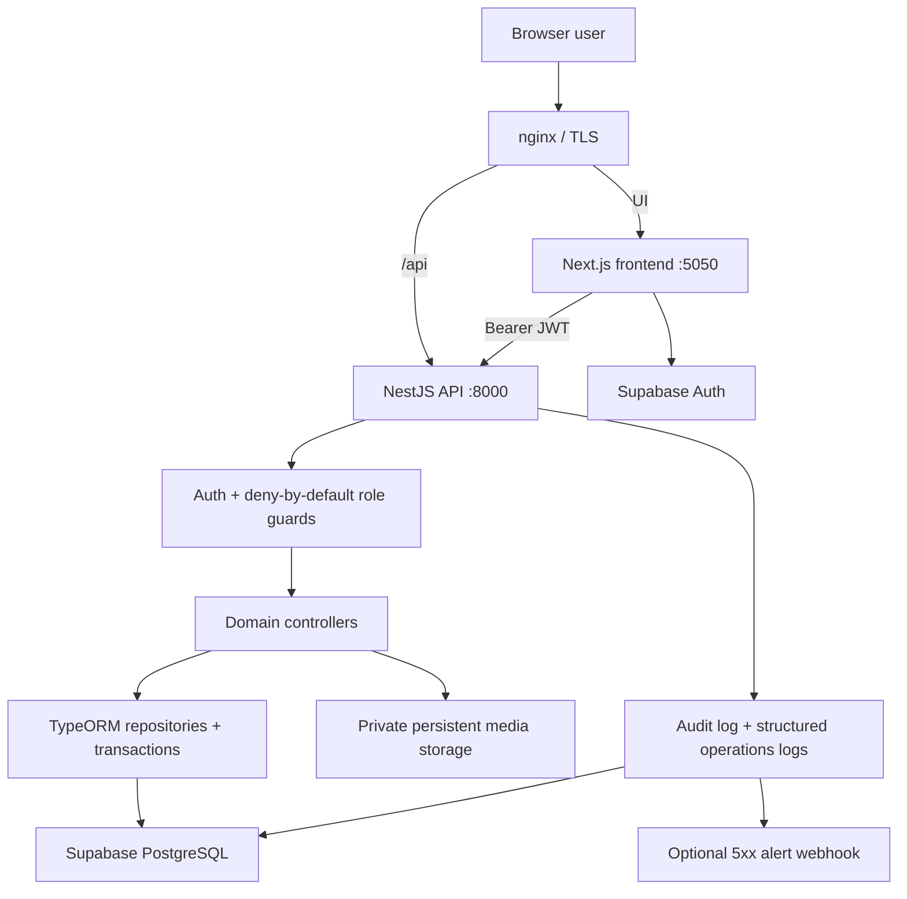
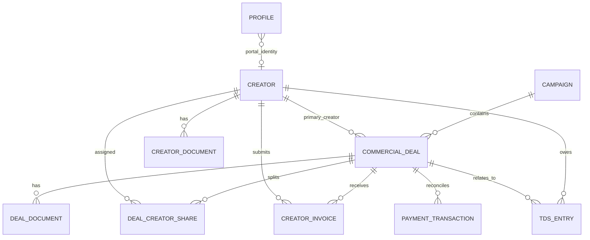
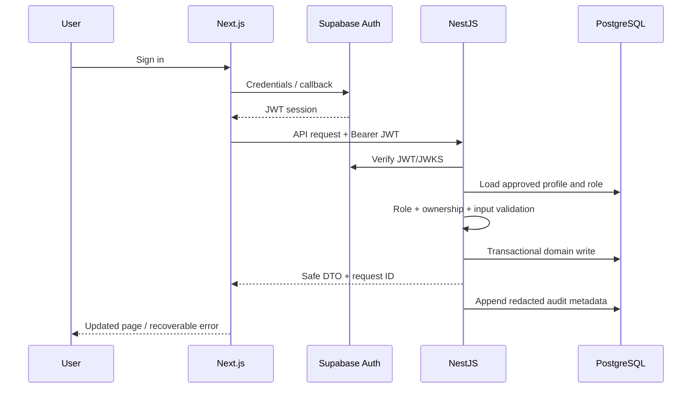

# TCH Financials architecture

## System hierarchy

The frontend never connects directly to financial tables. Supabase Auth issues
the user session; every financial request goes through the API, authentication,
role checks, ownership checks, validation, and database constraints.

## Domain hierarchy

- Campaign is the business grouping.
- Commercial deal is the financial source of truth.
- Creator shares describe split campaigns without duplicating a deal.
- Invoices, payments and TDS records reference the deal/creator rather than
  copying their full financial state.
- Overview, entity summary and alerts are derived views; they do not maintain
  separate financial totals.

## Roles and user flows

| Role | Primary flow | Important boundary |
|---|---|---|
| Super Admin | users, creators, campaigns, finance, audit logs | full application administration |
| Accounts | receivables, payables, transactions, TDS | cannot change commercial deal terms |
| TCH Member | creators and commercial campaign operations | cannot access payment ledger/TDS administration |
| Creator | own campaigns, invoices, payments and TDS | server filters by profile `creatorId`; client filters are never trusted |

## Financial data flow

1. A TCH Member creates or updates a campaign deal.
2. The API validates dates, enums, creator assignments, non-negative money and
   percentage bounds.
3. Fee derivation and billing-period synchronization run server-side.
4. TypeORM commits the deal and related split rows in a transaction.
5. PostgreSQL constraints provide a second enforcement layer.
6. Overview, entity summaries and alert queries recompute from committed deals.
7. Accounts records invoice/payment/TDS state through restricted endpoints.
8. Successful mutations append actor, route, field-name and request-ID audit
   metadata; field values and uploaded files are not copied into audit logs.

## Document flow

Uploads are limited by MIME type and size, stored below `MEDIA_ROOT`, and only
downloaded through authenticated API endpoints. Stored paths are containment-
checked to prevent traversal. There is no public `/media` route. Database and
media backups must be taken and restored as a pair because database rows store
paths while file bytes live on persistent media storage.

## Failure and concurrency model

- Versioned resources use optimistic locking and return HTTP 409 instead of
  overwriting a concurrent edit.
- Multi-row deal operations and payment imports use database transactions.
- Duplicate creator invoices, split creators and payment business keys have
  database uniqueness protection.
- Frontend route/global error boundaries avoid blank screens and warn users not
  to repeat an uncertain write without reloading.
- Every response has `X-Request-ID`; structured server logs use the same ID.

## Environments

| Environment | Database | Auth | Purpose |
|---|---|---|---|
| Docker development | `127.0.0.1:5433/tch_financials_dev` | mock Super Admin | safe feature work and synthetic tests |
| Local staging restore | `127.0.0.1:5434/tch_financials_staging` | database validation only | backup/restore rehearsal |
| Production | Supabase session pooler with verified TLS | real Supabase JWT | live application |

Production credentials must never be added to Docker Compose files or copied
into ordinary development containers.

